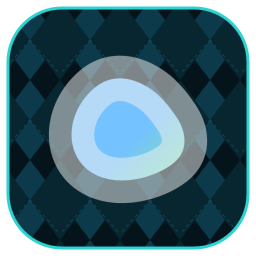

<p align="center">
  
</p>

# dockge

[Dockge](https://github.com/louislam/dockge) is a fancy, self-hosted Docker
Compose stack manager — a web UI for bringing `compose.yml` stacks up, down, and
restarting them. This repo is a first-class [orca](https://github.com/argyle-labs/orca)
plugin that owns the full lifecycle (install, update, backup/restore) plus a
tool surface for managing the stacks Dockge controls — and a curl-bootstrappable
Docker Compose deploy.

Dockge serves its web UI on `:5001`. It persists app state at `/app/data` and
manages compose stacks under `/opt/stacks` (the stacks directory must be the
**same absolute path** inside and outside the container).

## Two halves of one repo

| Half | What it is |
|---|---|
| **Deploy assets** (`Dockerfile`, `compose.yml`, `scripts/`, `examples/`) | Curl-bootstrappable install/update/backup payload — no git clone needed. |
| **orca plugin** (`src/`, `Cargo.toml`) | A Rust orca plugin whose only orca dependency is `plugin-toolkit`. Exposes the lifecycle + stack management as `#[orca_tool]`s. |

## Specs

| Resource | Value |
|---|---|
| CPU | 1 core |
| RAM | 256 MB |
| Disk | 1 GB |

Dockge is a thin Node web app; it shells out to the host's `docker compose` to
do the heavy lifting, so its own footprint is small.

---

## Docker / Compose

The reference deployment is [`compose.yml`](compose.yml). On any Linux host with
Docker:

```sh
./scripts/install.sh           # docker compose up -d in the repo root
# open http://<host>.local:5001
```

Dockge needs the host Docker socket (it manages other stacks) and an identical
absolute stacks path on host + container — see `DOCKGE_STACKS_DIR` in
`compose.yml`.

Update / back up:

```sh
./scripts/update.sh                                   # pull + recreate
./scripts/backup.sh /mnt/backups/dockge.tar.gz        # tar data + stacks
./scripts/restore.sh /mnt/backups/dockge.tar.gz       # extract + up -d
```

---

## Podman

The same [`compose.yml`](compose.yml) runs under Podman, but note Dockge shells
out to `docker compose` to manage stacks and mounts the Docker socket. To run
Dockge itself under Podman, map the Podman socket
(`/run/podman/podman.sock:/var/run/docker.sock`) and provide a `docker`-compatible
CLI; otherwise keep Dockge on Docker and use Podman only for other services.

```sh
podman compose -f compose.yml up -d
```

## Proxmox LXC

There are no native-LXC assets for Dockge — it ships as the upstream image. On
Proxmox, create a Debian/Ubuntu LXC, install Docker (Dockge manages Docker
Compose stacks, so Docker is the natural fit), and use the Docker / Compose path
above (Docker-in-LXC). The `/opt/stacks` path must be identical inside and
outside the container.

## orca plugin

### Tool surface

| Tool | Purpose |
|---|---|
| `dockge.{list,detail,create,update,delete}` | Endpoint registry CRUD (generated by `endpoint_resource!`). |
| `dockge.stacks` | List the compose stacks managed by one registered endpoint. |
| `dockge.stack_logs` | Recent logs for one `(endpoint, stack)`. |
| `dockge.stack_action` | Start / stop / restart one stack. |
| `dockge.install` | Bring up the Dockge web app via `docker compose up -d`. |
| `dockge.update` | Pull the newest image and recreate the container in place. |
| `dockge.backup` | Tar the app-data + managed-stacks directories. |

Register a running Dockge instance, then drive it:

```sh
orca dockge create --name home --base-url http://<host>.local:5001 --token "$TOKEN" --enabled true
orca dockge stacks --endpoint home
orca dockge stack_action --endpoint home --stack sonarr --action restart
```

A registered endpoint row syncs to every paired orca peer, so any creds-holder
can call `dockge.*` against it.

### Build

```sh
git clone https://github.com/scottdkey/dockge
cd dockge
# With an orca checkout at ../orca, the committed .cargo/config.toml patch
# resolves plugin-toolkit locally; otherwise it resolves from the pinned rc tag.
cargo build
cargo test
```

### The two-dependency rule

A compliant orca plugin's `[dependencies]` is **exactly two crates**:

| Dep | Why it is allowed |
|---|---|
| `plugin-toolkit` | The single orca gateway. Every other crate the plugin would reach for — serde, serde_json, schemars, clap, urlencoding, anyhow, tokio, tracing, rusqlite, and the db/dispatch/contract/derive infra — is re-exported through `plugin_toolkit::*` / its prelude, or injected by the `#[orca_tool]` / `endpoint_resource!` macros. The plugin source names **no** external crate through this dep. |
| `abi_stable` | **The one genuine non-toolkit dependency, and it cannot be removed.** See below. |

Everything else (the test crate's deps — `tokio` / `wiremock`) lives under
`[dev-dependencies]` and is outside the rule: dev-deps never ship in the cdylib.

### Why `abi_stable` is the unavoidable exception

orca loads external plugins as **cdylibs it `dlopen`s at runtime** — not as
statically linked crates. That crossing is a C-ABI FFI boundary, and the data
that crosses it (the root module, the version header, the layout hashes the
loader checks before it trusts the `.so`) must have a **guaranteed, stable memory
layout**. Rust's native `repr(Rust)` gives no such guarantee across independent
compilations, so the boundary types come from `abi_stable` (`RString`, `RStr`,
`RResult`, `PrefixTypeTrait`, …).

The decisive detail: `#[export_root_module]` — the attribute that emits the
single symbol orca's loader looks up — **expands to bare `::abi_stable::*` paths
in this crate's own root.** There is no source path for the toolkit to redirect
and no `crate =` attribute to retarget; the macro hard-codes the crate name into
generated code that lives *in the plugin*. So unlike serde/reqwest (whose paths
the toolkit redirects), `abi_stable` genuinely must be a direct dep.

It is pinned to **the same `abi_stable` version the toolkit uses** (`0.11`) so the
layout hash baked into the cdylib matches what orca's `plugin-loader` validates at
load time. A version skew here is not a compile error — it is a load-time
rejection. Keep it in lockstep with the toolkit.

The whole abi boundary is isolated to one file,
[`src/abi_export.rs`](src/abi_export.rs): the only place `abi_stable` is named,
the only place the JSON dispatch payload type is aliased, and the only place the
`disallowed_types` lint is suppressed.

### Authoring a fresh plugin from this template

To start a new `<name>` plugin from this repo's shape:

1. **Scaffold the crate.** Copy `Cargo.toml`, `.cargo/config.toml`,
   `src/abi_export.rs`, and a `src/` tree (`lib.rs`, `tools.rs`, plus
   `lifecycle.rs` as the surface needs). Keep `[lib] crate-type = ["cdylib",
   "rlib"]` — `cdylib` is the artifact orca loads; `rlib` keeps the in-crate test
   harness.

2. **Set `[dependencies]` to the two allowed crates** — `plugin-toolkit` (git dep
   on the orca rc tag) and `abi_stable = "0.11"` — nothing else. Put test tooling
   under `[dev-dependencies]`, including `plugin-toolkit` again if the test crate
   needs `serde_json::json!` for fixtures.

3. **Write the surface against the toolkit only.** `use
   plugin_toolkit::prelude::*;` for the common surface; reach
   `plugin_toolkit::http`, `plugin_toolkit::serde_json`,
   `plugin_toolkit::urlencoding`, etc. explicitly where the prelude doesn't cover
   it. Derive on hand-written types via `#[plugin_struct]` (or the explicit
   `#[derive(plugin_toolkit::serde::Serialize, …)] #[serde(crate =
   "plugin_toolkit::serde")]` form). **Do not** add a `thiserror` dep — hand-roll
   `Display` + `std::error::Error` + `From` as `DockgeError` does in
   [`src/lib.rs`](src/lib.rs); `?` conversion rides anyhow's blanket `From`.

4. **Update `abi_export.rs` metadata** — change `target_software`,
   `target_compat`, `orca_compat`, and `TOOL_PREFIX` to your `<name>.` namespace.
   Leave the rest of the FFI plumbing as-is.

5. **Prove the rule holds** before committing:
   ```sh
   cargo build && cargo clippy --all-targets -- -D warnings && cargo test
   cargo tree -e normal --depth 1   # MUST show only plugin-toolkit + abi_stable
   ```
   Any third crate under `[dependencies]` is a toolkit gap — file it against
   `plugin-toolkit` and route through it rather than adding the dep here.

---

## Tags

The container image is published to `ghcr.io/scottdkey/dockge:latest` by the
`build` workflow. Pin `DOCKGE_VERSION` as a build arg to track a specific
upstream Dockge release.
